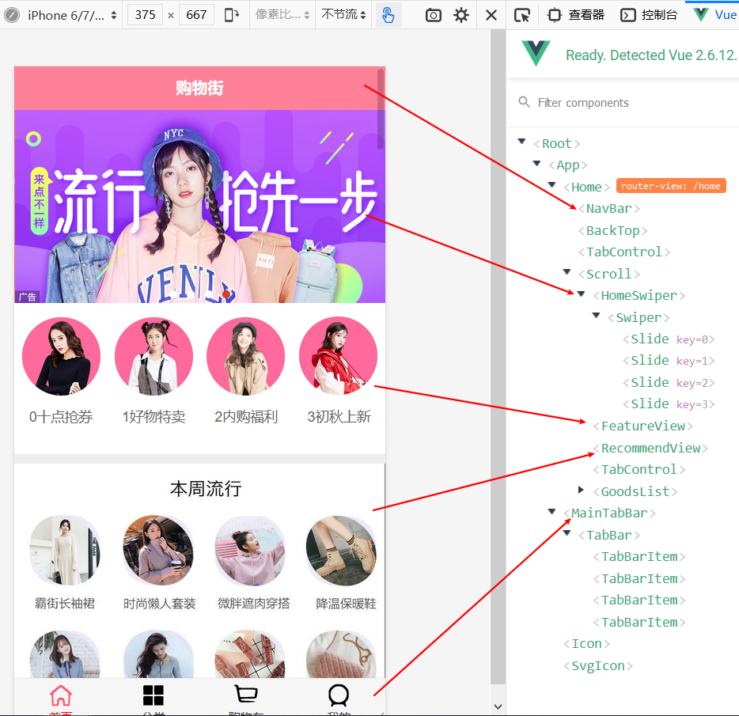
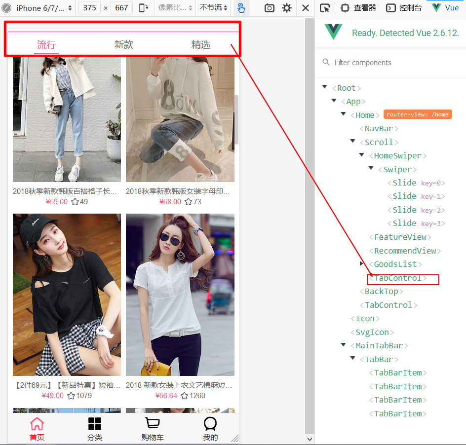

# yh-mall 一个典型移动端vue商城项目

## 1.项目思路

项目思路见我的博客--[项目思路-余浩的博客](https://blog.moonlet.cn/archives/625)

## 2.项目预览

### 2.1 商城首页组件



### 2.2 选项卡



## 3.项目起步

```javscript
npm install
```

### 编译并加载项目

```javscript
npm run serve
```

### 编译上线资源

```javscript
npm run build
```

### Lints and fixes files

```javscript
npm run lint
```

### Customize configuration

See [Configuration Reference](https://cli.vuejs.org/config/).
